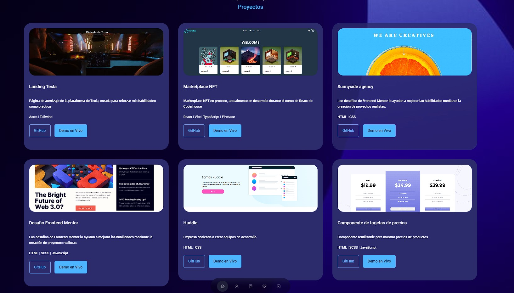

# React JS Portfolio Website

[🔗Live Demo🔗](https://portfolio-xi-roan-58.vercel.app/)

 
## Características

- **📖 Diseño de Una Sola Página**
- **🎨 Estilizado con React-Bootstrap y CSS con colores fáciles de personalizar**
- **📱 Totalmente Responsivo**

 

## 🚀 ¿Cómo empezar?

Clona este repositorio. Necesitarás tener `node.js` y `git` instalados globalmente en tu máquina.

## 🛠 Instalación y Configuración

1. Instalación: `npm install`
2. En el directorio del proyecto, puedes ejecutar: `npm start`

Ejecuta la aplicación en modo de desarrollo. Abre [http://localhost:3000](http://localhost:3000) para verla en el navegador. La página se recargará si haces cambios.

 
